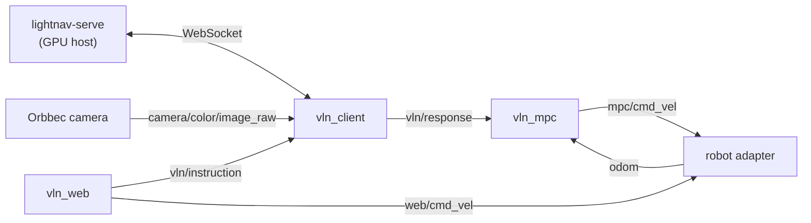

<!--
  Auto-translated from robot_deploy/README.md. Edit the English source, not this file.
  Frozen human translations: put translate: skip in an HTML comment.
-->

[English](README.md)

# robot_deploy

LightNav 部署的机器人端部分：一个 ROS 2 工作空间，将摄像头、[`lightnav-serve`](../docs/DEPLOYMENT.md) WebSocket 服务器、MPC 跟踪器和机器人底盘连接起来，并在其上提供一个 Web 控制面板。包含 Unitree Go2 和 LimX TRON1 的适配器；添加一个机器人意味着编写一个适配器包（[接入你自己的机器人](#bring-your-own-robot)）。

```text
robot_deploy/
├── README.md
├── scripts/           # build.sh
└── src/
    ├── vln_client/    # camera → lightnav-serve WebSocket client
    ├── vln_mpc/       # waypoint alignment + tracking MPC
    ├── vln_web/       # web control panel (port 8088)
    ├── vln_bringup/   # launch files: tron / go2
    └── robot_adapters/
        ├── go2_adapter/   # Unitree Go2 (unitree_sdk2py)
        └── tron_adapter/  # LimX TRON1 (WebSocket protocol)
```

## 架构



没有外部多路复用器：适配器同时订阅 `web/cmd_vel`（手动 WASD）和 `mpc/cmd_vel`（自主），并根据控制源在两者之间进行仲裁，将当前活动的源发布到 `control/source`。停止、命令看门狗以及将控制权交还给机器人自带的遥控器，都是适配器的职责。

模型本身运行在别处，位于 `lightnav-serve` 背后的 GPU 主机上——机器人无需 GPU。服务器端和通信协议参见 [docs/DEPLOYMENT.md](../docs/DEPLOYMENT.md)。若想在没有机器人的情况下试用这套技术栈，[`mujoco_demo/`](../mujoco_demo/README.md) 会针对模拟的 TurtleBot 运行相同的 MPC 和客户端协议。

## 从全新机器开始

已在 Ubuntu 22.04 和 ROS 2 Humble 上测试。

1. 安装 [ROS 2 Humble](https://docs.ros.org/en/humble/Installation.html)
   以及 `python3-colcon-common-extensions` + `python3-rosdep`。

2. 使用 rosdep 解析 ROS 依赖（消息包、Orbbec 摄像头驱动以及 apt 打包的 Python 依赖）：

   ```bash
   cd robot_deploy
   sudo rosdep init        # first time on this machine only
   rosdep update
   rosdep install --from-paths src --ignore-src -y
   ```

3. 为 `vln_mpc` 安装 CasADi——它没有 apt/rosdep 包，因此这一步需要手动完成：

   ```bash
   pip install "casadi>=3.7,<4"
   ```

4. **仅限 Go2：** 安装 Unitree 官方的
   [`unitree_sdk2_python`](https://github.com/unitreerobotics/unitree_sdk2_python)
   及其所需的 CycloneDDS 0.10.2——参见
   [go2_adapter/README.md](src/robot_adapters/go2_adapter/README.md)。

5. 构建并 source：

   ```bash
   ./scripts/build.sh
   source install/setup.bash
   ```

6. 为你的机器人启动技术栈（见下文），打开 `http://<robot-ip>:8088`，将 VLN 服务器 URL 设置为你的 `lightnav-serve` 地址，输入一条指令，然后按下 **Start VLN**。

## 运行

### LimX TRON1

```bash
ros2 launch vln_bringup tron.launch.py
```

适配器连接到机器人的地址为 `ws://10.192.1.2:5000`（TRON1 文档中给出的地址）；如果你的地址不同，可通过 `robot_url` 参数覆盖。

### Unitree Go2

```bash
ros2 launch vln_bringup go2.launch.py network_interface:=eth0
```

`network_interface` 是连接到 Go2 的网络接口（默认为 `enP8p1s0`）。

两个 launch 文件也会启动 Orbbec Gemini 330 驱动（仅彩色，640×360@30）。只要 `rgb8` 图像能到达 `camera/color/image_raw`，任何摄像头都可以——重映射或设置 `vln_client` 的 `image_topic` / `image_transport`（`raw` 或 `compressed`）参数，并从 launch 文件中移除 Orbbec 的 include 即可。

## Web 面板

`vln_web` 在端口 `8088` 上提供一个单页面板：带预测轨迹叠加的实时摄像头预览、VLN 启动/停止和任务模式（Track / ObjNav）、VLN 服务器 URL 切换、机器人状态和模式按钮、WASD 手动驾驶、MPC 和 WASD 限制的热重载、命令/里程计速度图表，以及板载计算机的 Wi-Fi 切换（通过 `nmcli`）。

## 包

- **`vln_client`** — 订阅摄像头，与 `lightnav-serve` 通信，并发布推理响应、状态和可视化路径。
- **`vln_mpc`** — 在图像采集时将路点对齐到 `odom`，并以 10 Hz 使用 CasADi MPC 跟踪它们，发布 `mpc/cmd_vel`。
- **`vln_web`** — 上述 Web 面板。
- **`vln_bringup`** — 按机器人组合摄像头 + 客户端 + MPC + Web + 适配器的 launch 文件。
- **`go2_adapter` / `tron_adapter`** — 将下述通用接口转换为各机器人的原生 API。

每个包的 README 都记录了其完整的 topic/参数接口。

## 接入你自己的机器人

编写一个使用通用接口的 ROS 2 包，然后复制 `tron.launch.py` 并替换为你的适配器：

订阅：

- `web/cmd_vel`、`mpc/cmd_vel`（`geometry_msgs/TwistStamped`）——按控制源进行仲裁；将当前活动的那个转发给你的底盘。

发布：

- `odom`（`nav_msgs/Odometry`）——`odom` → `base_link`，带有真实时间戳（MPC 会依据此历史对齐路点）。
- `diagnostics`（`diagnostic_msgs/DiagnosticArray`）——供 Web 面板使用的连接、模式、电池、IMU、电机状态。
- `control/source`（`std_msgs/String`）——`disabled`、`manual` 或 `auto`。
- `robot/events`（`std_msgs/String`）——自由格式的事件日志。

服务（`std_srvs/Trigger`）：

- `control/set_manual`、`control/set_auto`、`control/stop`
- `robot/stand`、`robot/walk`、`robot/sit`、`robot/emergency_stop`

安全预期：适配器负责命令看门狗（如果命令过期则停止——`tron_adapter` 使用 0.35 秒并发送一串零速度帧）、停止行为，以及在源为 `disabled` 时将控制权交还给机器人自带的遥控器。`tron_adapter`（WebSocket 机器人）和 `go2_adapter`（厂商 SDK 机器人）是两个参考实现。
